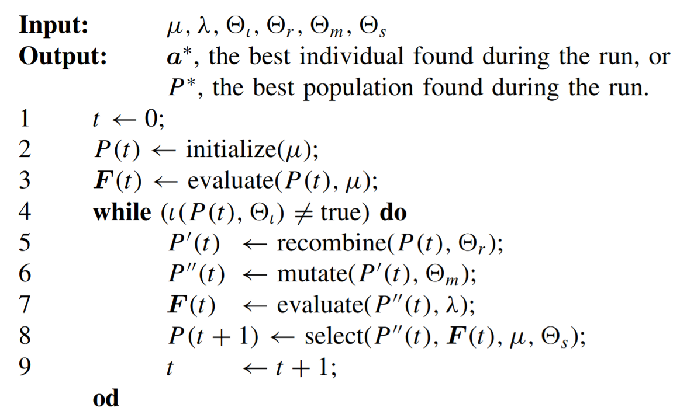
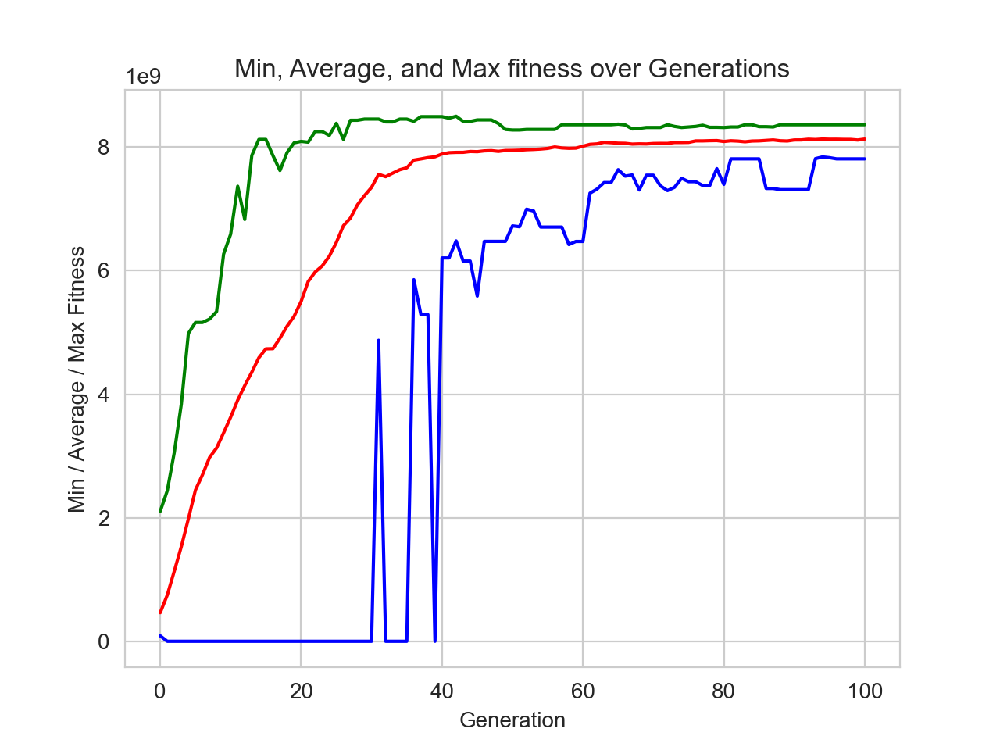
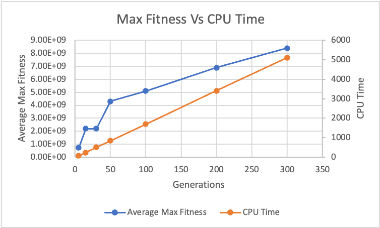

# vacdist
An Exploration of Genetic Algorithm using DEAP: COVID-19 Vaccine Distribution Optimization

This is an exercise in the exploration of the Genetic Algorithm as part of ECE 788: Computational Intelligence class with Prof. Qing Gary Liu at the New Jersey Institute of Technology.

## ProblemEvolution
- Inspired by “Locating an Emergency Response Unit” problem from the Haupt & Haupt, “Practical Genetic Algorithms” 2004.
- Started off with Optimization of resource distribution in an epidemic/pandemic/emergencies in Myanmar.
- For pragmatic data access, it switched from Myanmar to United States.
- Problem got more specific: COVID-19  Vaccine Distribution

## ProblemDefinition
If we have 1 million vaccine doses available and we have to distribute the vaccine by county (with average country population of 100,000), then, we have to find 10 counties with the highest risk to send the vaccines to. In order to do so, we want to find maxima value of the 10 counties in question.

### FitnessFunction
The concept is based on Patel, et al., set up of the optimization problem for finding optimal vaccination strategies for pandemic influenza using genetic algorithm.

where:

- g = number of age groups from Census Bureau
- n_i = population size of each age group
- R_t = infection rate OR reproductive number
- c = index of case density in the county risk factor
- h = index of ICU headroom risk factor
- d_i = likelihood of death for each age group (modified to fit CDC age bins)

This problem is not representative of the real-world considerations with regards to vaccine distribution for COVID-19. This is an exercise for an optimization problem in Genetic Algorithms.
My goal here is to create a value for each county that represents the relative risk level. This achieves my goal and all I have to do with Genetic Algorithm is simply solving for a sum of relative risk level for a set of 10 counties that are or close to the global maxima.

#### CensusBureauAgeGroups
Using Census Bureau’s 2019 population estimates for all the counties in 50 states + District of Columbia. Data has bins for age groups with 5-year intervals, the last bin being 85+ year olds

#### InfectionRate (CovidActNow)
- Infection rate is the estimated number of new people each COVID-positive person will infect. Also known as “R(t),” the infection rate tells us how fast COVID is spreading in a specific area, at a specific time. For example, an infection growth rate of 3 means that one case of COVID would produce three new secondary cases.
- This value can change over time, depending on behavior and interventions within a community. Infection rate is different from the total number of cases because a place with a smaller population and few total cases can still have a very high infection rate, meaning that one person could go on to infect many people.
- The higher the R(t) is in a given place, the faster COVID is spreading there; an R(t) above 1 means that the number of cases is growing, while an R(t) below 1 means that cases are shrinking. Covid Act Now uses R(t), or infection rate, as one of its main metrics for COVID risk assessment.
- The value range from 0 and above.

#### CaseDensity (CovidActNow)
- Case density is a measure of the number of COVID cases divided by the number of people (per capita) in a given community. Case density can refer to new cases over, say, the last 14 days or it can refer to total cases since the onset of the pandemic. The word “density” means that the case counts are expressed as a per-capita value.
- Case density risk levels are represented with the range of 0 to 4.

#### ICU_Headroom (CovidActNow)
- ICU headroom used is the percentage of ICU beds available for COVID patients, after excluding those already in use by non-COVID patients. It is used to measure an Intensive Care Unit’s (ICU) ability to handle a surge of patients in the case of a COVID outbreak. The ICU is the part of a hospital reserved for people who are very sick. Each bed is equipped with special equipment that regular hospital beds don’t have, and usually have one or two dedicated nurses to monitor each patient.
- ICU headroom used is one of Covid Act Now’s main metrics for understanding COVID, as measuring and predicting ICU capacity gives a picture of whether hospitals can handle an increased load of new COVID cases without having to resort to crisis standards of care.
- ICU Headroom risk levels are represented with the range of 0 to 4.

#### DeathLikelihoodByAge (CDC)
Since, CDC’s age bins do not exactly match up with Census Bureau’s, I changed 5-17 years bin to 5 - 19 years and 18 - 29 years to 20 - 29 years.

### DEAPeaSimple
DEAP used Chapter 7 (Introduction to evolutionary algorithms) of Back, Fogel and Michalewicz, “Evolutionary Computation 1 : Basic Algorithms and Operators”, 2000.
It’s based on Genetic algorithms, Evolution strategies, and Evolutionary programming methods.
You can tweak the parameters to use it as Simple Genetic Algorithm, which is how I have used it for this project.

#### eaSimplePseudocode

where:
- µ (mu): parent
- λ (lamda): child
- Θ_ι (theta_iota): termination criterion
- Θ_r (theta_r): recombination/crossover criterion
- Θ_m (theta_m): mutation criterion
- Θ_s (theta_s): selection criterion

## Findings
Findings are based on 2019 census estimates and CovidActNow data as of 14:09 on 11/30/2020. Each set has 3 runs using different DEAP settings on base M1 Macbook Air (Late 2020). We also have a known optimal solution which is 1.1e+10.

### SGA_Parameters (Population)
Started with population parameters based on Alajmi & Wright's finding showing it has higher impact on fitness than other parameters.

|  | Set 1 | Set 2 | Set 3 | Set 4 | Set 5 | Set 6 | Set 7 |
| --------------- | --------------- | --------------- | --------------- | --------------- | --------------- | --------------- | --------------- |
| Genes | 10 | 10 | 10 | 10 | 10 | 10 |
| Population | 5 | 15 | 30 | 50 | 100 | 200 | 300 |
| crossover | 1-pt (0.75) | 1-pt (0.75) | 1-pt (0.75) | 1-pt (0.75) | 1-pt (0.75) | 1-pt (0.75) | 1-pt (0.75) |
| Mutation | Uni (0.1) | Uni (0.1) | Uni (0.1) | Uni (0.1) | Uni (0.1) | Uni (0.1) | Uni (0.1) |
| Selection | Roulette | Roulette | Roulette | Roulette | Roulette | Roulette | Roulette |
| Generations | 500 | 500 | 500 | 500 | 500 | 150 | 100 |
| HallOfFame | None | None | None | None | None | None | None |
| CPU Time (Sec) | 68 | 242 | 508 | 843 | 1693 | 1022 | 1020 |
| Best Solution | 9.2e+08 | 2.9e+09 | 2.8e+09 | 5.0e+09 | 6.0e+09 | 8.9e+09 | 9.1e+09 |
| Converge Gen | 9 | 4 | 24 | 37 | 27 | 55 | 79 |

The above image shows the stats from the Set 7 Run 2. Below are the counties as well as their risk rank that was generated as the best solution on Set 7 Run 2.
- Broward County ,  Florida (4th)
- Ocean County ,  New Jersey (8th)
- Hudson County ,  New Jersey (34th)
- Hampden County ,  Massachusetts (42nd)
- Clark County ,  Nevada (1st)
- Maricopa County ,  Arizona (9th)
- Tarrant County ,  Texas (17th)
- Essex County ,  Massachusetts (10th)
- Middlesex County ,  Massachusetts (13th)
- Cook County ,  Illinois (11th)

As we can see, the list includes 5 FIPS areas with the top 10 worst risk, from all the FIPS areas in 50 states as well as District of Columbia, with exception of areas with NaN rows from CovidActNow. This is an expected result with Genetic Algorithms. GA doesn't produce the perfect optimal solution. But it does however get very close to the optimal solution.

We can also observe from the table that the best solution and CPU time has a positive correlation to the change in population. However, when we plot it, we get a better understand of what's going on.

We can see here that there is a diminishing returns to fitness with regards to running additional generations. However, the CPU time is a linear relation. Meaning that there will be a point where it's not worth adding additional generations to get better fitness results as the cost of CPU time will not give us similar level of returns anymore.

### SGA_Parameters (HallofFame)
|  | Set 7 | Set 8 |
| --------------- | --------------- | --------------- |
| Genes | 10 | 10 |
| Population | 300 | 300 |
| crossover | 1-pt (0.75) | 1-pt (0.75) |
| Mutation | Uni (0.1) | Uni (0.1) |
| Selection | Roulette | Roulette |
| Generations | 100 | 100 |
| HallOfFame | None | 10 |
| CPU Time (Sec) | 1020 | 1037 |
| Best Solution | 9.1e+09 | 7.1e+09 |
| Converge Gen | 79 | 73 |

HallOfFame (Set 8): Improvements in fitness were not observed. If anything, there seems to be higher selection pressure and ends up with a premature convergence. There were no real change on processing time.

### SGA_Parameters (Mutation Only)
|  | Set 7 | Set 9 |
| --------------- | --------------- | --------------- |
| Genes | 10 | 10 |
| Population | 300 | 300 |
| crossover | 1-pt (0.75) | 1-pt (0) |
| Mutation | Uni (0.1) | Uni (0.1) |
| Selection | Roulette | Roulette |
| Generations | 100 | 100 |
| HallOfFame | None | None |
| CPU Time (Sec) | 1020 | 145 |
| Best Solution | 9.1e+09 | 2.4e+09 |
| Converge Gen | 79 | 73 |

Mutation Only (Set 9): Results depends on the starting population’s max fitness. The max fitness doesn’t really change over the runs as this only allows for local search. With a mutation probability of 0.1, the changes over generations is limited. There is also a significant decrease in processing time as it does not require any crossover processing, meaning the cost of crossover is significantly higher than mutation.

### SGA_Parameters (Crossover Only)
|  | Set 7 | Set 10 |
| --------------- | --------------- | --------------- |
| Genes | 10 | 10 |
| Population | 300 | 300 |
| crossover | 1-pt (0.75) | 1-pt (0.75) |
| Mutation | Uni (0.1) | Uni (0) |
| Selection | Roulette | Roulette |
| Generations | 100 | 100 |
| HallOfFame | None | None |
| CPU Time (Sec) | 1020 | 145 |
| Best Solution | 9.1e+09 | 7.7e+09 |
| Converge Gen | 79 | 73 |

Crossover Only (Set 10): This should not work at all as EA. It’s basically randomly exploring without a local search to accompany it. A small decrease in processing time was observed.

### SGA_Parameters (Crossover Probability)
|  | Set 7 | Set 11 | Set 12 |
| --------------- | --------------- | --------------- | --------------- |
| Genes | 10 | 10 | 10 |
| Population | 300 | 300 | 300 |
| crossover | 1-pt (0.75) | 1-pt (0.6) | 1-pt (0.9) |
| Mutation | Uni (0.1) | Uni (0.1) | Uni (0.1) |
| Selection | Roulette | Roulette | Roulette |
| Generations | 100 | 100 | 100 |
| HallOfFame | None | None | None |
| CPU Time (Sec) | 1020 | 838 | 1199 |
| Best Solution | 9.1e+09 | 8.9e+09 | 9.6e+09 |
| Converge Gen | 79 | 40 | 34 |

Crossover Probability Change (Set 11 & 12): Average fitness over three runs for each crossover probability 0.75, 0.6, and 0.9 are 8.7e+09, 7.9e+09, and 8.0e+09 respectively. The move towards the upper and lower bounds seems to produce some change fitness but not by a significant level as other changes. I also noticed that processing time has a linear relationship with the crossover probability.

### SGA_Parameters (Mutation Probability)
|  | Set 7 | Set 13 |
| --------------- | --------------- | --------------- |
| Genes | 10 | 10 |
| Population | 300 | 300 |
| crossover | 1-pt (0.75) | 1-pt (0.75) |
| Mutation | Uni (0.1) | Uni (1/300) |
| Selection | Roulette | Roulette |
| Generations | 100 | 100 |
| HallOfFame | None | None |
| CPU Time (Sec) | 1020 | 993 |
| Best Solution | 9.1e+09 | 8.8e+09 |
| Converge Gen | 79 | 48 |

Mutation Probability Change (Set 13): Reducing the mutation probability to the lower bound did reduce the processing time without an observable significant change on fitness in this limited run.

### SGA_Parameters (2-point Crossover)
|  | Set 7 | Set 14 |
| --------------- | --------------- | --------------- |
| Genes | 10 | 10 |
| Population | 300 | 300 |
| crossover | 1-pt (0.75) | 2-pt (0.75) |
| Mutation | Uni (0.1) | Uni (0.1) |
| Selection | Roulette | Roulette |
| Generations | 100 | 100 |
| HallOfFame | None | None |
| CPU Time (Sec) | 1020 | 1016 |
| Best Solution | 9.1e+09 | 8.1e+09 |
| Converge Gen | 79 | 48 |

2-point Crossover (Set 13): There seems to be a drop in fitness between 1 point and 2-point crossovers. However, I am unable to ascertain the cause of it. Since I only conducted 3 runs per set, this difference might not be statistically siginificant.

### SGA_Parameters (Survivor Selection)
|  | Set 7 | Set 16 | Set 18 |
| --------------- | --------------- | --------------- | --------------- |
| Genes | 10 | 10 | 10 |
| Population | 300 | 300 | 300 |
| crossover | 1-pt (0.75) | 1-pt (0.75) | 1-pt (0.75) |
| Mutation | Uni (0.1) | Uni (0.1) | Uni (0.1) |
| Selection | Roulette | Survivor | Survivor |
| Generations | 100 | 100 | 200 |
| HallOfFame | None | None | None |
| CPU Time (Sec) | 1020 | 1050 | 2188 |
| Best Solution | 9.1e+09 | 7.8e+09 | 6.0e+09 |
| Converge Gen | 79 | n/a | n/a |

Fitness-based Survivor Selection (Set 16 & 18): This selects the best individuals from the population. I was expecting it to converge very quickly but it did not. I did observe it to have a positive regression line over a 100 generation. I ran a second set with 200 generations and did not see any significant improvement.

### SGA_Parameters (Survivor Selection)
|  | Set 7 | Set 15 | Set 17 |
| --------------- | --------------- | --------------- | --------------- |
| Genes | 10 | 10 | 10 |
| Population | 300 | 300 | 300 |
| crossover | 1-pt (0.75) | 1-pt (0.75) | 1-pt (0.75) |
| Mutation | Uni (0.1) | Uni (0.1) | Uni (0.1) |
| Selection | Roulette | Tourn (64) | Tourn (128) |
| Generations | 100 | 100 | 100 |
| HallOfFame | None | None | None |
| CPU Time (Sec) | 1020 | 1105 |1118 |
| Best Solution | 9.1e+09 | 6.2e+09 | 4.9e+09 |
| Converge Gen | 79 | 4 | 23 |

Tournament Selection (Set 15 & 17): One of the benefits of Tournament selection is that it seems to maintain diversity, meaning it keeps the exploration aspect of EA. According to Blickle and Thiele, we can check the variance of fitness distribution to determine if diversity is maintained. For the first set, I used McGowan’s rule of thumb to set the tournament size, 20% of pop and find the nearest power of 2.

## References
Alajmi, A., & Wright, J. (2014, June). Selecting the most efficient genetic algorithm sets in solving unconstrained building optimization problem. International Journal of Sustainable Built Environment, 3(1), 18-26.

Bäck, T. (2000). Introduction to evolutionary algorithms. In Evolutionary Computation 1 Basic Algorithms and Operators. Bristol, United Kingdom: Institute of Physics.

Blickle, T., & Thiele, L. (1995, July). A Mathematical Analysis of Tournament Selection. Proceedings of the 6th International Conference on Genetic Algorithms (ICGA95), 9-16.

Centers for Disease Control and Prevention. (2020, August 18). COVID-19 Hospitalization and Death by Age. Retrieved from Centers for Disease Control and Prevention: https://www.cdc.gov/coronavirus/2019-ncov/covid-data/investigations-discovery/hospitalization-death-by-age.html

CovidActNow. (2020). Tools. Retrieved from CovidActNow: https://covidactnow.org/tools

Gad, A. (2020). GeneticAlgorithmPython. Retrieved from GitHub: https://github.com/ahmedfgad/GeneticAlgorithmPython

Haupt, R. L., & Haupt, S. E. (2004). Practical Genetic Algorithms. Hoboken, New Jersey: John Wiley & Sons.

McGowan, C. (2017, March 9). Genetic Algorithms: Tournament Selection. Retrieved from Medium: https://medium.com/@c4lv1nmcg0wan/genetic-algorithms-tournament-selection-b150bc76f0d8

Patel, R., Longini, I. M., Jr, & Halloran, M. E. (2005). Finding optimal vaccination strategies for pandemic influenza using genetic algorithms. Journal of theoretical biology, 234(2), 201–212. https://doi.org/10.1016/j.jtbi.2004.11.032

Rainville, F.-M. d., Fortin, F.-A., Gagné, C., Gagnon, O., Gardner, M.-A., Grenier, S., . . . Parizeau, M. (2020). DEAP. Retrieved from GitHub: https://github.com/deap/deap

Song, C. (2019). Decision_Making_with_GA_using_DEAP. Retrieved from GitHub: https://github.com/daydrill/ga_pycon_2016_apac/blob/master/Decision_Making_with_GA_using_DEAP.ipynb

United States Census Bureau. (2020). County Population by Characteristics: 2010-2019. Retrieved from United States Census Bureau: https://www.census.gov/content/census/en/data/datasets/time-series/demo/popest/2010s-counties-detail.html
